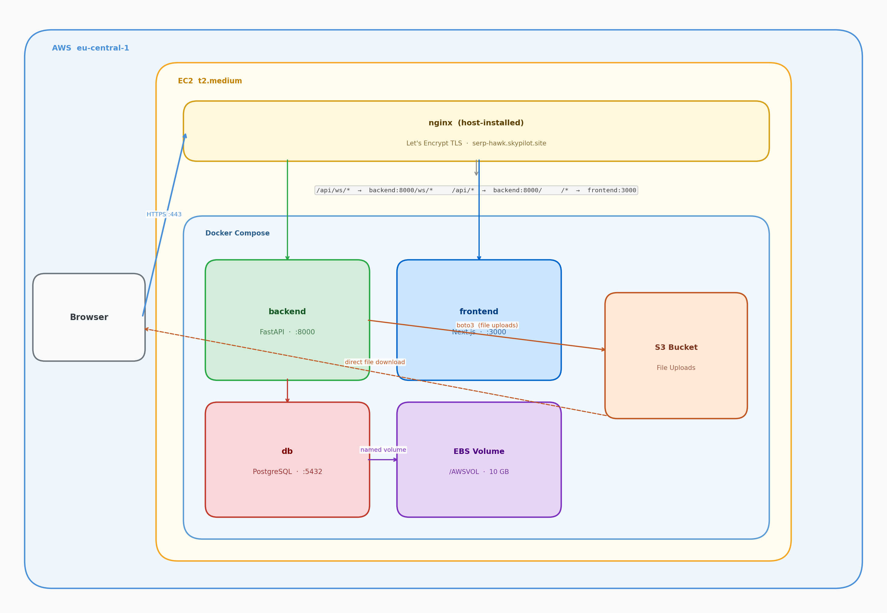

# SerpHawk CRM — AWS Deployment Guide

Full-stack CRM for SEO agencies. Backend: FastAPI (Python). Frontend: Next.js 16. Database: PostgreSQL.

**Live:** https://serp-hawk.skypilot.site

| | |
|---|---|
| **URL** | https://serp-hawk.skypilot.site/login |
| **Username** | admin@example.com |
| **Password** | Unlock@123 |

> **Please Note:** This is a demo deployment provisioned for evaluation purposes. The infrastructure will be taken down on **28th September 2026**. We appreciate your interest and kindly request that any testing or review be completed before that date. Thank you for your understanding.

---

## AWS Architecture



---

## AWS Services

| Service | Role | Why |
|---|---|---|
| **EC2 t2.medium** | Runs all Docker containers | 2 vCPU, 4 GB RAM. Comfortably runs all three Docker services (backend, frontend, PostgreSQL) without memory pressure. |
| **EBS 10 GB (additional)** | Docker data volume mounted at `/AWSVOL` | PostgreSQL data persists across restarts and redeployments. |
| **S3** | File uploads | Container disk is ephemeral. S3 is durable and files are served directly from S3, saving EC2 bandwidth. |
| **IAM Instance Role** | S3 access for backend | No access keys needed — boto3 picks up credentials from EC2 instance metadata automatically. |
| **Let's Encrypt** | TLS certificate | Free, auto-renews every 90 days. No ALB needed. |

---

## Deployment Files

| File | Purpose |
|---|---|
| `Dockerfile` | Backend image — Python 3.11-slim, runs uvicorn |
| `frontend/Dockerfile` | Frontend image — 2-stage Node 20 build, Next.js standalone output |
| `docker-compose.yml` | Orchestrates `backend`, `frontend`, `db` |
| `nginx.conf` | Host nginx — TLS, path-based routing, WebSocket upgrade |
| `.env.example` | Template for `.env` on EC2 |
| `terraform/` | IaC — provisions EC2, EBS, S3, IAM, Elastic IP |

---

## Infrastructure Provisioning (Terraform)

```bash
cd terraform
export AWS_PROFILE=aws-darwin-personal
terraform init
terraform apply
```

Note the outputs — **Elastic IP** and **S3 bucket name** are needed in later steps.

---

## Deployment Steps

### 1. SSH into EC2

```bash
ssh -i ~/.ssh/serp-hawk-project.pem ubuntu@<ELASTIC_IP>
```

### 2. Mount EBS volume

```bash
sudo mkfs -t ext4 /dev/xvdf
sudo mkdir -p /AWSVOL
sudo mount /dev/xvdf /AWSVOL
echo '/dev/xvdf /AWSVOL ext4 defaults,nofail 0 2' | sudo tee -a /etc/fstab

sudo mkdir -p /AWSVOL/docker /etc/docker
sudo tee /etc/docker/daemon.json <<'EOF'
{
  "data-root": "/AWSVOL/docker",
  "log-driver": "json-file",
  "log-opts": { "max-size": "10m", "max-file": "3" }
}
EOF
```

### 3. Install Docker

```bash
sudo apt-get update
sudo apt-get install -y docker.io docker-compose-plugin git
sudo usermod -aG docker ubuntu
newgrp docker
sudo systemctl restart docker
```

### 4. Clone and configure

```bash
git clone <your-repo-url> /opt/crm
cd /opt/crm
cp .env.example .env
nano .env
```

Fill in all values in `.env` — refer to the Environment Variables Reference below.

### 5. Build and start

```bash
docker compose up -d --build
docker compose ps
```

### 6. Install and configure nginx

```bash
sudo apt-get install -y nginx
sudo cp /opt/crm/nginx.conf /etc/nginx/sites-available/crm
sudo ln -sf /etc/nginx/sites-available/crm /etc/nginx/sites-enabled/crm
sudo rm -f /etc/nginx/sites-enabled/default
sudo nginx -t
sudo systemctl restart nginx
```

### 7. Point DNS

At your registrar add an A record:
```
yourdomain.com → <EC2 Elastic IP>
```
Verify propagation before the next step:
```bash
dig yourdomain.com +short
```

### 8. Get TLS certificate

```bash
sudo apt-get install -y certbot python3-certbot-nginx
sudo certbot --nginx -d yourdomain.com \
  --non-interactive --agree-tos --email you@youremail.com

# Auto-renewal
(crontab -l 2>/dev/null; echo "0 12 * * * certbot renew --quiet && systemctl reload nginx") | crontab -
```

### 9. Verify

```bash
curl https://yourdomain.com/api/health
# {"status":"ok","service":"serphawk-crm"}
```

---

## Redeploying After Code Changes

```bash
cd /opt/crm
git pull
docker compose up -d --build
docker image prune -f
```

> If `NEXT_PUBLIC_API_BASE_URL` changes, rebuild the frontend image specifically: `docker compose up -d --build frontend`

---

## Environment Variables Reference

| Variable | Required | Description |
|---|---|---|
| `POSTGRES_USER` | Yes | PostgreSQL username |
| `POSTGRES_PASSWORD` | Yes | PostgreSQL password |
| `POSTGRES_DB` | Yes | Database name |
| `OPENAI_API_KEY` | Yes | OpenAI API key |
| `SENDER_EMAIL` | Yes | Outlook SMTP sender address |
| `SENDER_PASSWORD` | Yes | Outlook app password |
| `S3_BUCKET_NAME` | Yes | S3 bucket for file uploads |
| `AWS_REGION` | Yes | AWS region (`eu-central-1`) |
| `FRONTEND_ORIGIN` | Yes | Frontend URL for CORS |
| `NEXT_PUBLIC_API_BASE_URL` | Yes | Backend API base URL (baked into frontend image at build time) |
